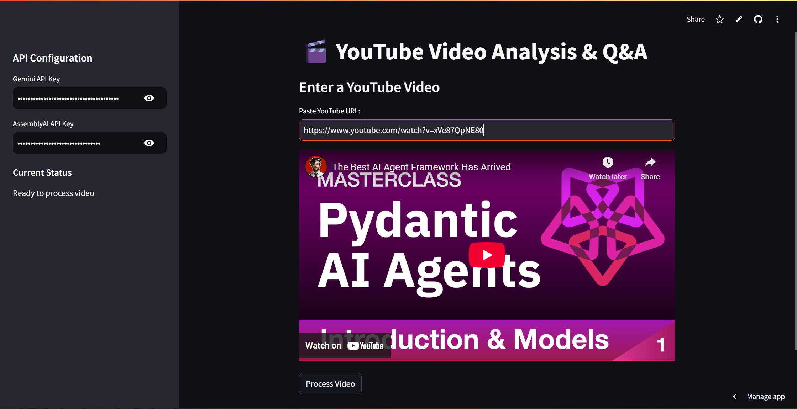
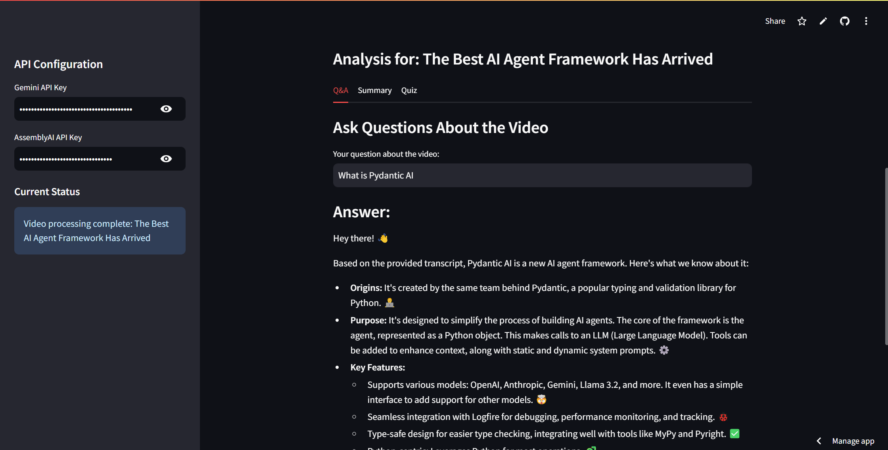
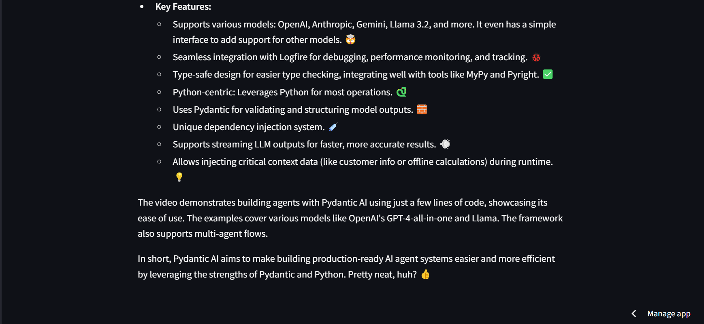
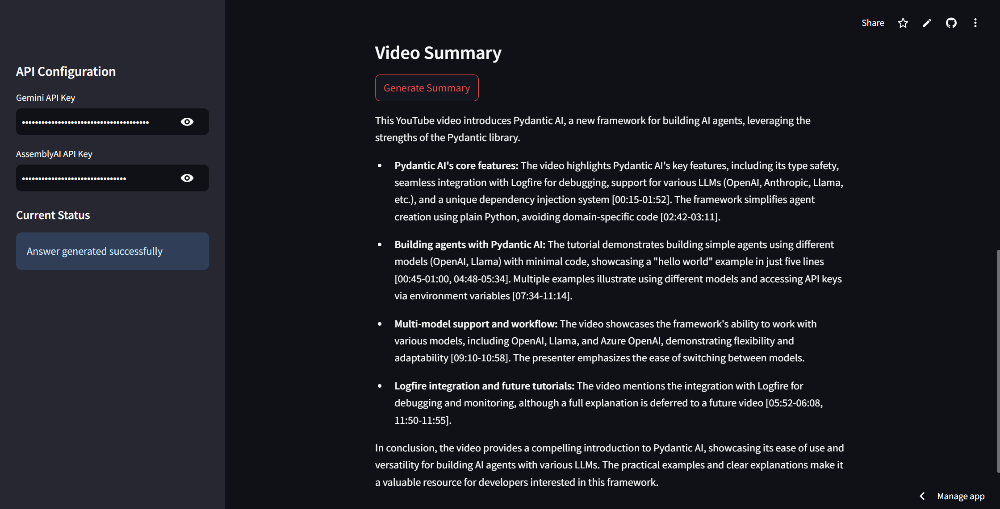

# TubeTalk 🎥

**AI-powered insights from YouTube videos – instantly!**
-----------------------------------------------------

## 🧠 About

**TubeTalk** is an AI-powered app that helps users quickly understand YouTube videos. Just paste a YouTube video URL to:

- ▶️ **Watch the video**
- ✨ **Get an AI-generated summary**
- 💬 **View live chat replay**

No more watching entire videos just to find key points! 🚀

---

## 🖼️ Screenshots

Take a peek at the interface!






---

## 🌟 Features

✅ Extracts video transcripts
✅ Generates AI summaries instantly
✅ Shows live chat replay
✅ Clean and user-friendly interface

---

## 🛠️ Run Locally

Want to run **TubeTalk** on your machine? Follow these steps 🧩:

1. **Clone the repository**

   ```bash
   git clone https://github.com/gomesjonathan99/TubeTalk-.git
   cd Tubetalk-
   ```
2. **Create and activate a virtual environment**

   ```bash
   python -m venv venv
   # Activate it:
   # On Windows:
   venv\Scripts\activate
   # On macOS/Linux:
   source venv/bin/activate
   ```
3. **Create a `.env` file** and add your OpenAI API key:

   ```
   ASSEMBLYAI_API_KEY=""
   GEMINI_API_KEY=""
   ```
4. **Install dependencies**

   ```bash
   pip install -r requirements.txt
   ```
5. **Run the app**

   ```bash
   streamlit run main/main.py
   ```
---

## 🐳 Docker Version

For Docker version just run the below command:

```bash
docker-compose up
```
---

Enjoy smarter YouTube watching with **TubeTalk**! 🎧💡
