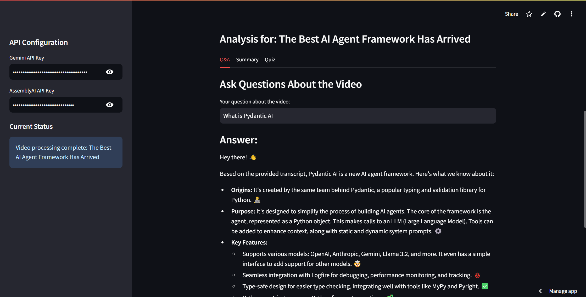
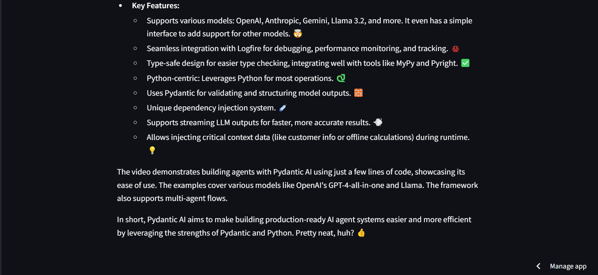
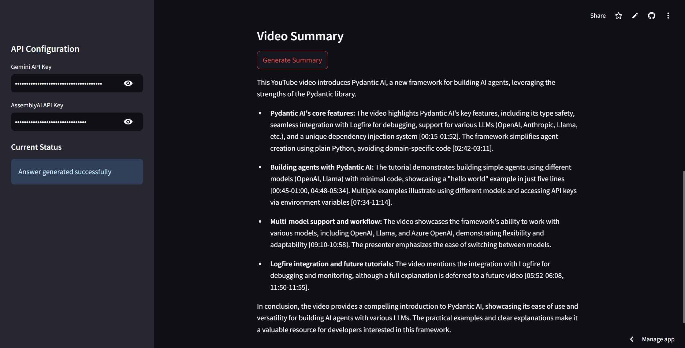

# TubeTalk 🎥

**AI-powered insights from YouTube videos – instantly!**
-----------------------------------------------------

## 🧠 About

**TubeTalk** is an AI-powered app that helps users quickly understand YouTube videos. Just paste a YouTube video URL to:

- ▶️ **Watch the video**
- ✨ **Get an AI-generated summary**
- 💬 **Ask questions about the video content**
- 📝 **Generate a knowledge quiz**

No more watching entire videos just to find key points! 🚀

---

## 🖼️ Screenshots

Take a peek at the interface!






---

## 🌟 Features

✅ Extracts video transcripts (via YouTube Transcript API)
✅ Falls back to AssemblyAI audio transcription when captions aren't available
✅ Semantic Q&A powered by FAISS vector search
✅ AI-generated summaries and multiple-choice quizzes
✅ Clean and user-friendly Streamlit interface

---

## 🤖 Powered By

| Component | Model |
|---|---|
| LLM | `gpt-4o-mini` (OpenAI) |
| Embeddings | `text-embedding-3-small` (OpenAI) |
| Vector store | FAISS |
| Fallback transcription | AssemblyAI |

---

## 🛠️ Run Locally

Want to run **TubeTalk** on your machine? Follow these steps 🧩:

1. **Clone the repository**

   ```bash
   git clone https://github.com/devgomesai/TubeTalk-AI.git
   cd TubeTalk-AI
   ```

2. **Create and activate a virtual environment**

   ```bash
   python -m venv venv
   # On Windows:
   venv\Scripts\activate
   # On macOS/Linux:
   source venv/bin/activate
   ```

3. **Install dependencies**

   ```bash
   pip install -r requirements.txt
   ```

4. **Run the app**

   ```bash
   streamlit run main/main.py
   ```

5. **Enter your API keys in the sidebar**
   - **OpenAI API Key** — [Get one here](https://platform.openai.com/api-keys)
   - **AssemblyAI API Key** — [Get one here](https://www.assemblyai.com/) *(only needed when YouTube captions are unavailable)*

---

## 🐳 Docker Version

For Docker version just run the below command:

```bash
docker-compose up
```

---

Enjoy smarter YouTube watching with **TubeTalk**! 🎧💡
